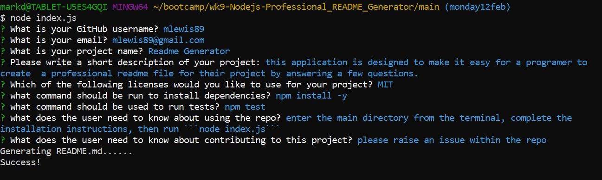

# Bootcamp Challenge Week Nine - Node js - Professional Readme Generator
[](https://opensource.org/licenses/MIT)


## Description

The purpose of this application is to test my knowledge of Node JS, by prompting the user for information about their project and then generating a professional README.md file.

This application saves the user time in producing a readme file.

During this project I learnt how to create links and dynamic iamges within the markdown language, while also improving my knowledge of the inquirer package.

## Table of Contents
    
- [User Story](#sser-story)
- [Acceptance Criteria](#acceptance-criteria)
- [Installation](#installation)
- [Usage](#usage)
- [Screenshots](<#screenshots-of-completed-challenge>)
- [License](#license)
- [Credits](#credits)
- [Questions / How to Contribute](#questions--how-to-contribute)

## User Story

```
AS A developer
I WANT a README generator
SO THAT I can quickly create a professional README for a new project
```

## Acceptance Criteria

```
GIVEN a command-line application that accepts user input
WHEN I am prompted for information about my application repository
THEN a high-quality, professional README.md is generated with the title of my project and sections entitled Description, Table of Contents, Installation, Usage, License, Contributing, Tests, and Questions
WHEN I enter my project title
THEN this is displayed as the title of the README
WHEN I enter a description, installation instructions, usage information, contribution guidelines, and test instructions
THEN this information is added to the sections of the README entitled Description, Installation, Usage, Contributing, and Tests
WHEN I choose a license for my application from a list of options
THEN a badge for that license is added near the top of the README and a notice is added to the section of the README entitled License that explains which license the application is covered under
WHEN I enter my GitHub username
THEN this is added to the section of the README entitled Questions, with a link to my GitHub profile
WHEN I enter my email address
THEN this is added to the section of the README entitled Questions, with instructions on how to reach me with additional questions
WHEN I click on the links in the Table of Contents
THEN I am taken to the corresponding section of the README
```


## Installation

Clone the repo to a local folder and then from the terminal inside the main directory, run the following command to install the necessary dependancies.
       
    npm install -y

## Usage
    
Open the terminal in the Main Folder and enter the following command and answer the prompts

    node index.js

GitHub repository
https://github.com/mlewis89/wk9-Nodejs-Professional_README_Generator/

## Screenshots of Completed Challenge



[Click here to view a video of the application in use](./assets/wk9-readme%20generator.mp4)

## License
This project is licensed under the MIT.
    
## Questions / How to Contribute
    
If you have any questions about the repo, open an issue. You can veiw my other work on git hub [mlewis89](https://github.com/mlewis89/)

## Credits

Monash University Full Stack Coding bootcamp


---
